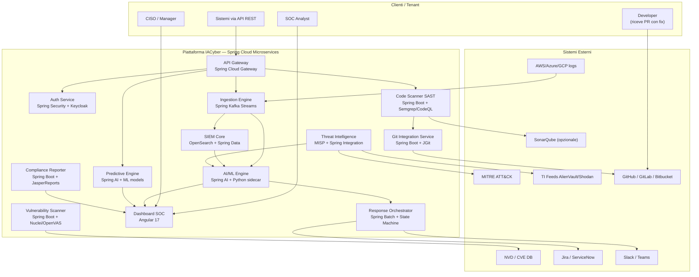
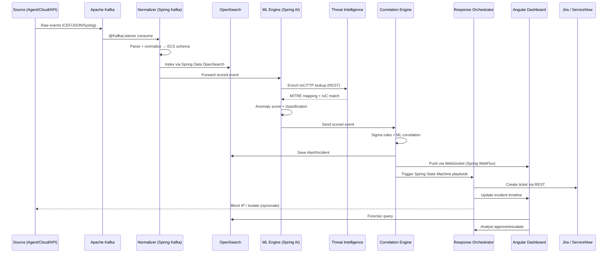
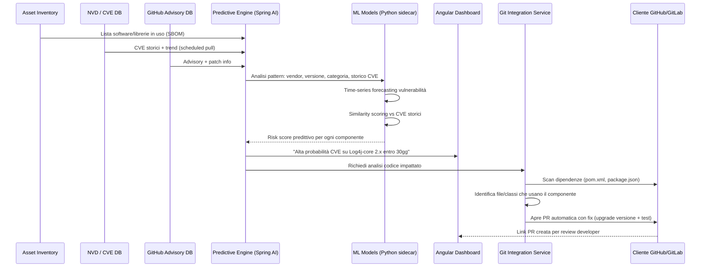
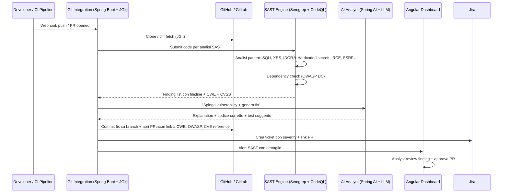
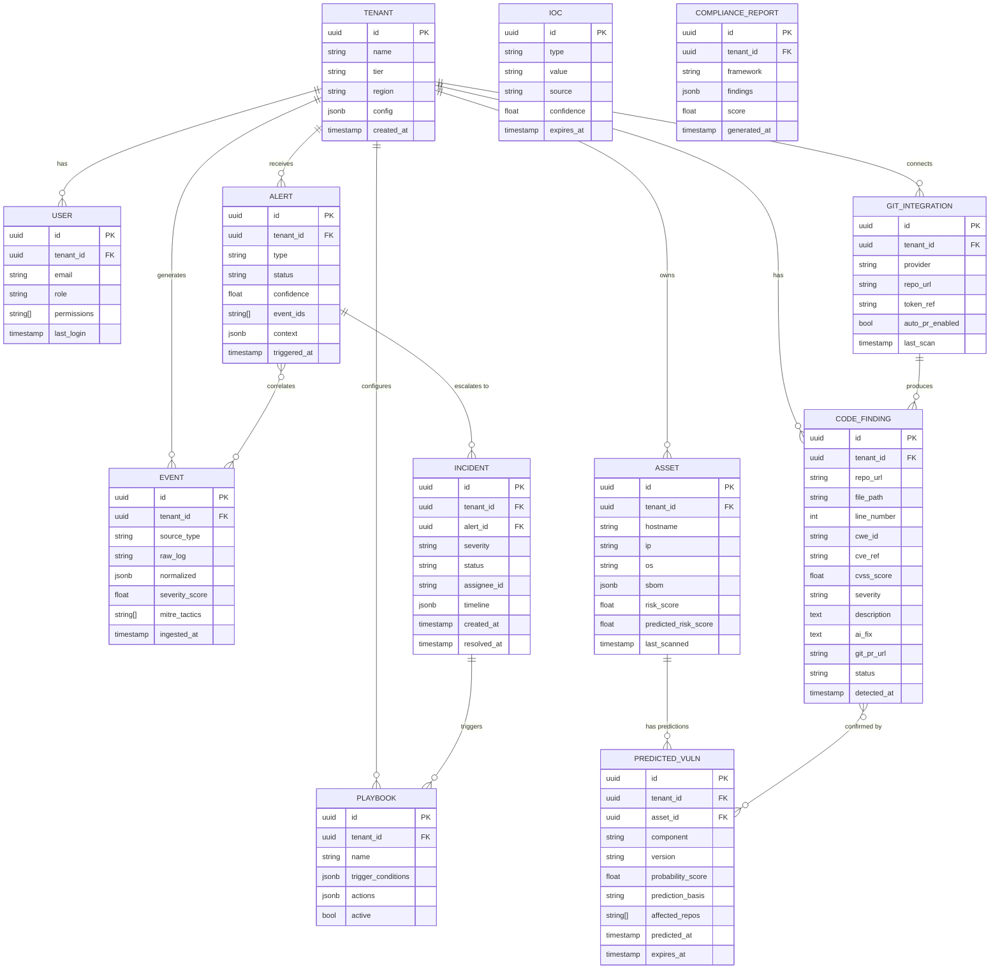
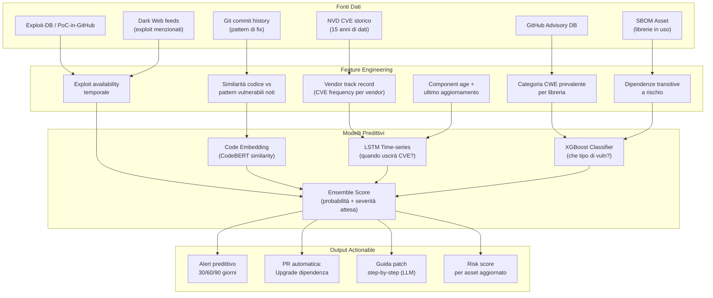
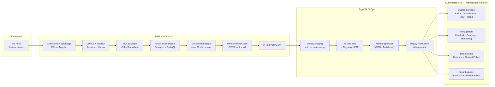
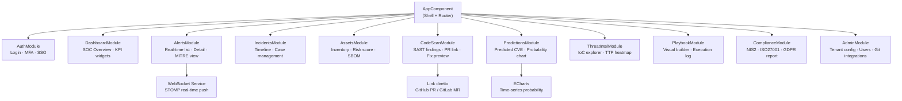

# IACyber — Implementation Plan Completo

> AI-powered Cybersecurity & Threat Detection Platform
> Versione 2.0 — Aprile 2026
> Stack: Java 21 + Spring Boot 3 · Angular 17 · Kafka · OpenSearch

---

## Visione del Prodotto

**IACyber** è una piattaforma SaaS multi-tenant di AI-powered Cybersecurity e Threat Detection con capacità predittiva sulle vulnerabilità, scansione statica del codice sorgente e integrazione Git nativa per remediation automatica. Vendibile a MSSP, enterprise e PMI.

**Differenziatori chiave vs concorrenza:**
- Predice vulnerabilità *prima* che vengano pubblicate (ML su pattern CVE)
- Scansiona il codice dei clienti (SAST) e apre PR con il fix direttamente su GitHub/GitLab
- AI analyst spiega ogni alert in linguaggio naturale con remediation step-by-step

---

## 1. Architettura C4 — Contesto Sistema



---

## 2. Flusso Dati — Threat Detection End-to-End



---

## 3. Flusso — Predictive Vulnerability Engine



---

## 4. Flusso — Code Scanner SAST + Git Fix



---

## 5. Modello Dati Core



---

## 6. Stack Tecnologico

### Separazione responsabilità

```
┌─────────────────────────────────────────────────────────────┐
│  JAVA 21 + SPRING BOOT 3                                     │
│  → API REST, business logic, orchestrazione, auth,          │
│    Kafka consumers, gateway, compliance, Git integration,    │
│    scheduling, WebSocket, tutto ciò che è "piattaforma"     │
├─────────────────────────────────────────────────────────────┤
│  PYTHON 3.12 (FastAPI — microservizi AI autonomi)           │
│  → Modelli ML, anomaly detection, predizione CVE,           │
│    SAST AI analysis, LLM orchestration, NLP, embeddings     │
│    Esposti come REST API interne, chiamati da Spring        │
└─────────────────────────────────────────────────────────────┘
```

Spring non tocca mai il codice ML — chiama Python via REST/gRPC.
Python non espone nulla all'esterno — solo endpoint interni protetti.

### Tabella Stack

| Layer | Tecnologia | Chi la gestisce |
|---|---|---|
| **API Gateway** | Spring Cloud Gateway | Java/Spring |
| **Auth & RBAC** | Spring Security + Keycloak 24 | Java/Spring |
| **Business Logic** | Spring Boot 3.3 + Spring Cloud | Java/Spring |
| **Stream Processing** | Spring Kafka (@KafkaListener) | Java/Spring |
| **SIEM Indexing** | Spring Data OpenSearch | Java/Spring |
| **Correlation Engine** | Spring Boot + Sigma rules | Java/Spring |
| **Response Orchestrator** | Spring State Machine + Spring Batch | Java/Spring |
| **Git Integration** | Spring Boot + JGit + GitHub API | Java/Spring |
| **Compliance Reporter** | Spring Boot + JasperReports | Java/Spring |
| **Notification Service** | Spring Boot + Spring Mail/Slack SDK | Java/Spring |
| **Vulnerability Scanner** | Spring Boot (orchestratore Nuclei/OpenVAS) | Java/Spring |
| **--- AI/ML boundary ---** | **tutto sotto è Python** | |
| **Anomaly Detection API** | Python FastAPI + Isolation Forest/Autoencoder | Python |
| **Threat Classifier API** | Python FastAPI + XGBoost (MITRE ATT&CK) | Python |
| **Predictive CVE API** | Python FastAPI + LSTM + time-series | Python |
| **SAST AI Analyzer API** | Python FastAPI + CodeBERT + LLM | Python |
| **NLP Analyst API** | Python FastAPI + LangChain + Claude/GPT-4 | Python |
| **Embedding Service** | Python FastAPI + sentence-transformers | Python |
| **--- Storage & Infra ---** | | |
| **SIEM Storage** | OpenSearch | Infra |
| **Database** | PostgreSQL 16 + TimescaleDB | Infra |
| **Cache** | Redis | Infra |
| **Message Broker** | Apache Kafka 3.7 | Infra |
| **Frontend** | Angular 17 (Standalone Components) | Frontend |
| **UI Components** | Angular Material + ECharts | Frontend |
| **Real-time UI** | Angular STOMP over WebSocket | Frontend |
| **Orchestration** | Kubernetes + Helm | DevOps |
| **IaC** | Terraform | DevOps |
| **CI/CD** | GitHub Actions + ArgoCD | DevOps |
| **Build Java** | Maven 3.9 multi-module | DevOps |
| **Build Python** | Poetry + Docker | DevOps |
| **Monitoring** | Micrometer (Java) + Prometheus + Grafana | DevOps |
| **Secret Mgmt** | HashiCorp Vault | DevOps |
| **Service Mesh** | Istio (mTLS) | DevOps |

---

## 7. Struttura Monorepo

```
IACyber/
│
│  ══════════════════════════════════════
│  JAVA — Spring Boot (API & Platform)
│  ══════════════════════════════════════
├── pom.xml                              # Parent POM — BOM Spring Boot 3.3
├── spring-services/
│   ├── gateway-service/                 # Spring Cloud Gateway — routing, JWT, rate limit
│   ├── auth-service/                    # Spring Security + Keycloak adapter
│   ├── ingestion-service/               # @KafkaListener, ECS normalizer, log parsing
│   ├── siem-service/                    # OpenSearch indexing + Sigma rule execution
│   ├── correlation-service/             # Alert correlation (Spring State Machine)
│   ├── ai-orchestrator-service/         # Chiama Python AI APIs — NON contiene ML
│   │   └── client/
│   │       ├── AnomalyDetectionClient   # Feign → Python anomaly-api
│   │       ├── ThreatClassifierClient   # Feign → Python classifier-api
│   │       ├── PredictiveCveClient      # Feign → Python predictive-api
│   │       └── NlpAnalystClient         # Feign → Python nlp-api
│   ├── threat-intel-service/            # MISP client + feed aggregator + IoC lookup
│   ├── vuln-scanner-service/            # Orchestratore Nuclei/OpenVAS (CLI wrapper)
│   ├── code-scanner-service/            # Orchestratore Semgrep/CodeQL — chiama Python per AI fix
│   ├── git-integration-service/         # JGit + GitHub/GitLab API + PR automation
│   ├── response-orchestrator/           # Playbook engine + Spring Batch
│   ├── compliance-service/              # NIS2/ISO27001/GDPR — JasperReports PDF
│   └── notification-service/           # Slack, Teams, Email, PagerDuty
│
│  ══════════════════════════════════════
│  PYTHON — AI/ML Services (FastAPI)
│  ══════════════════════════════════════
├── python-ai/
│   ├── anomaly-detection-api/           # FastAPI — Isolation Forest + Autoencoder (UEBA)
│   │   ├── main.py
│   │   ├── models/isolation_forest.py
│   │   ├── models/autoencoder.py
│   │   └── pyproject.toml              # Poetry
│   ├── threat-classifier-api/           # FastAPI — XGBoost MITRE ATT&CK classifier
│   │   ├── main.py
│   │   ├── models/xgboost_classifier.py
│   │   └── training/train.py
│   ├── predictive-cve-api/              # FastAPI — LSTM CVE forecasting + risk scoring
│   │   ├── main.py
│   │   ├── models/lstm_forecaster.py
│   │   ├── models/codebert_similarity.py
│   │   └── data/nvd_fetcher.py
│   ├── sast-ai-api/                     # FastAPI — AI code analysis + fix generation
│   │   ├── main.py
│   │   ├── analyzer/cwe_detector.py
│   │   ├── fixer/patch_generator.py    # LangChain + LLM
│   │   └── embeddings/code_embedder.py
│   └── nlp-analyst-api/                 # FastAPI — Alert summarization + remediation (LLM)
│       ├── main.py
│       ├── chains/alert_chain.py       # LangChain RAG su knowledge base MITRE
│       └── chains/remediation_chain.py
│
│  ══════════════════════════════════════
│  FRONTEND — Angular 17
│  ══════════════════════════════════════
├── frontend/
│   └── soc-dashboard/
│       ├── src/app/
│       │   ├── core/                   # Auth, guards, HTTP interceptors, WebSocket
│       │   ├── features/
│       │   │   ├── dashboard/          # SOC overview + KPI widgets
│       │   │   ├── alerts/             # Alert list realtime + MITRE detail
│       │   │   ├── incidents/          # Case management + forensic timeline
│       │   │   ├── assets/             # Inventory + SBOM + risk score
│       │   │   ├── code-scan/          # SAST findings + diff viewer + PR link
│       │   │   ├── predictions/        # Predicted CVE + probability ECharts
│       │   │   ├── threat-intel/       # IoC explorer + TTP heatmap
│       │   │   ├── compliance/         # NIS2 / ISO27001 / GDPR reports
│       │   │   └── playbooks/          # Visual playbook builder
│       │   └── shared/                 # Components, pipes, models TypeScript
│       └── package.json
│
│  ══════════════════════════════════════
│  INFRA & DevOps
│  ══════════════════════════════════════
├── infra/
│   ├── terraform/                       # VPC, EKS, RDS, MSK, ElastiCache, Vault
│   ├── helm/                            # Chart separato per ogni servizio
│   └── kubernetes/                      # Namespace, RBAC, NetworkPolicy, Istio
├── docs/
│   ├── api/                             # OpenAPI 3.1 (generati da Spring + FastAPI)
│   ├── architecture/                    # ADR — Architecture Decision Records
│   └── compliance/                      # Framework mappings NIS2/ISO/GDPR
└── .github/
    └── workflows/
        ├── ci-java.yml                  # Maven build + JUnit + SpotBugs + Trivy
        ├── ci-python.yml                # Poetry + pytest + Bandit + Safety
        ├── ci-angular.yml               # npm + Karma + ESLint + Playwright
        └── deploy.yml                   # ArgoCD sync trigger
```

---

## 8. Predictive Vulnerability Engine — Dettaglio

Questo è il modulo più innovativo della piattaforma. Predice vulnerabilità **prima** che vengano pubblicate o sfruttate.



**Accuracy target:** > 70% delle vulnerabilità HIGH/CRITICAL predette correttamente entro 90 giorni dalla pubblicazione CVE reale (validato su dataset storico NVD 2015-2024).

---

## 9. Code Scanner SAST — Regole e Copertura

| Categoria | Tool | Linguaggi | CWE coperte |
|---|---|---|---|
| **Injection** | Semgrep | Java, JS, Python, Go, PHP | CWE-89, 78, 917 |
| **XSS** | Semgrep + CodeQL | Java, JS, TS | CWE-79, 80 |
| **Broken Auth** | Semgrep custom rules | Java Spring, Node | CWE-287, 384 |
| **Hardcoded Secrets** | Semgrep + Trufflehog | All | CWE-798 |
| **SSRF** | CodeQL | Java, Python | CWE-918 |
| **Insecure Deser.** | CodeQL | Java | CWE-502 |
| **Path Traversal** | Semgrep | Java, Python | CWE-22 |
| **Dep. Vulnerabilities** | OWASP DC + Trivy | Maven, npm, pip | NVD CVE |
| **Crypto weak** | Semgrep | Java, Python | CWE-326, 327 |
| **Race Conditions** | CodeQL | Java | CWE-362 |

### Git Fix Automation — Come funziona

1. **Finding trovato** → AI genera spiegazione + fix code patch
2. **JGit crea branch** `iacyber/fix/CWE-89-UserRepo-L42`
3. **Commit patch** con messaggio strutturato: `fix(security): CWE-89 SQL injection in UserRepository:42`
4. **PR aperta** con:
   - Descrizione vulnerabilità + impatto
   - Diff codice originale vs corretto
   - Link a CWE, OWASP Top 10, CVE reference
   - Test unitario suggerito dall'AI
   - Severity + CVSS score
5. **Notifica** al developer via Slack/email + ticket Jira
6. **Dashboard SOC** mostra stato PR (open/merged/rejected)

---

## 10. Architettura DevOps / CI-CD



---

## 11. Pattern Architetturali

### Spring Boot — Struttura standard ogni microservizio

```
spring-services/[service-name]/
├── src/main/java/com/iacyber/[service]/
│   ├── config/
│   │   ├── SecurityConfig.java          # Spring Security + JWT resource server
│   │   ├── KafkaConfig.java             # Producer/Consumer beans
│   │   └── TenantConfig.java            # Multi-tenant filter
│   ├── domain/                          # Entità JPA + value objects
│   ├── repository/                      # Spring Data JPA / OpenSearch repos
│   ├── service/                         # Business logic pura
│   ├── kafka/
│   │   ├── consumer/                    # @KafkaListener
│   │   └── producer/                    # KafkaTemplate wrappers
│   ├── api/
│   │   ├── rest/                        # @RestController — esposto all'esterno
│   │   └── websocket/                   # @MessageMapping STOMP
│   ├── client/                          # Feign clients
│   │   ├── [OtherSpringService]Client   # verso altri Spring services
│   │   └── [PythonAiService]Client      # verso Python AI APIs (stessa struttura)
│   └── dto/                             # Request/Response records Java
├── src/test/java/
│   ├── unit/                            # JUnit 5 + Mockito
│   ├── integration/                     # @SpringBootTest + Testcontainers
│   └── arch/                            # ArchUnit: layer rules enforced
└── pom.xml                              # Eredita parent POM
```

**Pattern Java/Spring:**
- **Multi-tenancy:** `TenantContext` ThreadLocal + `@TenantFilter` su ogni JPA query
- **Event-driven:** Outbox pattern — ogni cambio stato pubblica evento Kafka
- **Circuit breaker:** Resilience4j su tutte le chiamate inter-service (incluse Python APIs)
- **Tracing:** OpenTelemetry → Jaeger, propagato anche nelle chiamate verso Python

### Python FastAPI — Struttura standard ogni AI service

```
python-ai/[service-name]-api/
├── main.py                              # FastAPI app + router mount
├── routers/
│   └── predict.py                       # Endpoint REST (chiamati da Spring via Feign)
├── models/
│   └── [model_name].py                  # Classe modello ML (train + predict)
├── training/
│   ├── train.py                         # Script training offline
│   └── datasets/                        # Dataset preprocessati
├── schemas/
│   └── request_response.py              # Pydantic models (validazione I/O)
├── core/
│   ├── config.py                        # Settings (pydantic-settings)
│   └── security.py                      # Verifica token interno (shared secret)
├── tests/
│   └── test_predict.py                  # pytest
├── Dockerfile
└── pyproject.toml                       # Poetry dependencies
```

**Pattern Python AI:**
- Ogni servizio è **stateless** — modelli caricati in memoria all'avvio
- **Autenticazione interna:** shared secret header `X-Internal-Token` (non esposto fuori dal cluster)
- **Versioning modelli:** MLflow per tracking esperimenti e model registry
- **Retraining:** scheduled job Python separato, ricarica modello senza restart

---

## 12. Angular Dashboard — Struttura Feature Modules



---

## 13. Roadmap 18 Mesi

### FASE 1 — Foundation Spring (Mesi 1-3)
**Goal: Core microservizi funzionanti, primo tenant**

| Task | Dettaglio |
|---|---|
| Monorepo Maven setup | Parent POM, Spring Cloud Config Server, Eureka |
| API Gateway | Spring Cloud Gateway + JWT validation + multi-tenant routing |
| Auth Service | Keycloak 24 + Spring Security OAuth2 Resource Server |
| Ingestion Service | @KafkaListener + ECS normalizer (Syslog, CEF, JSON, WinEvents) |
| SIEM Service | OpenSearch indexing + Sigma rule execution |
| Angular shell | App skeleton + auth (Keycloak Angular adapter) + routing |
| Dashboard MVP | Alert list real-time via WebSocket STOMP |

**Milestone M1:** Log ingestiti → alert su dashboard Angular in < 2 secondi

---

### FASE 2 — AI & Prediction (Mesi 4-6)
**Goal: ML in produzione, predizioni CVE attive**

| Task | Dettaglio |
|---|---|
| ML Bridge Service | Spring AI + Python sidecar (FastAPI) per modelli ML |
| Anomaly Detection | Isolation Forest per network + UEBA |
| Threat Classifier | XGBoost → classificazione MITRE ATT&CK |
| Predictive Engine MVP | LSTM su dataset NVD 2015-2024, predizioni 30/60/90gg |
| SBOM Ingestion | Parser Maven/npm/pip per asset inventory |
| Threat Intel | MISP integration + IoC lookup cache Redis |
| Angular Predictions | Panel predizioni con ECharts time-series |

**Milestone M2:** Predizione corretta su 65%+ CVE HIGH/CRITICAL (back-test 2023-2024)

---

### FASE 3 — Code Scanner & Git (Mesi 7-9)
**Goal: SAST operativo, PR automatiche funzionanti**

| Task | Dettaglio |
|---|---|
| Code Scanner Service | Semgrep + CodeQL runner orchestrato da Spring Boot |
| Git Integration Service | JGit + GitHub/GitLab API (webhook + clone + PR) |
| AI Fix Generator | Spring AI → LLM genera patch code + test suggerito |
| Auto PR creation | Branch naming, commit strutturato, PR con full context |
| OWASP Dep Check | Integrazione in pipeline SAST |
| Angular CodeScan | Finding list + diff viewer + link PR + status tracking |
| Vuln Scanner | Nuclei + OpenVAS per network/machine scanning |

**Milestone M3:** Finding SAST → PR con fix in < 5 minuti, copertura 10 CWE critiche

---

### FASE 4 — Response & Compliance (Mesi 10-12)
**Goal: SOAR completo, compliance reporting, enterprise-ready**

| Task | Dettaglio |
|---|---|
| Playbook Engine | Spring State Machine + visual builder Angular |
| Response Actions | Block IP, isolate host, disable AD account via API |
| Jira/ServiceNow | Integrazione bidirezionale ticket ↔ incident |
| NIS2 Reporter | Mapping eventi → articoli NIS2, JasperReports PDF |
| ISO 27001 | Audit trail + control scoring automatico |
| GDPR Module | Breach detection + 72h notification workflow |
| SSO Enterprise | SAML 2.0 per grandi clienti |
| SOC 2 prep | Audit log immutabile + evidenze automatiche |

**Milestone M4:** Primo cliente enterprise live, compliance report NIS2 approvato da auditor

---

### FASE 5 — Scale & Market (Mesi 13-18)
**Goal: Crescita clienti, marketplace, MSSP channel**

| Task | Dettaglio |
|---|---|
| Marketplace | 50+ connettori (Splunk, CrowdStrike, Defender, Wiz) |
| White-label | Ribranding Angular + Keycloak per MSSP partner |
| Self-service | Trial automatico + billing Stripe integrato |
| Advanced UEBA | Behavioral baseline per utente/asset |
| Threat Hunting | Query DSL custom + pre-built hunt playbooks |
| Predictive V2 | CodeBERT per similarity su codice sorgente |
| Mobile | Angular PWA + notifiche push per alert critici |
| Partner Portal | Gestione sub-tenant + revenue dashboard MSSP |

**Milestone M5:** 10+ clienti paganti, MRR > €50k, 3 MSSP partner attivi

---

## 14. Modello di Business

### Piani SaaS

| Piano | Target | Prezzo | Incluso |
|---|---|---|---|
| **Starter** | PMI < 200 dip. | €2.500/mese | 5 utenti · 10GB logs/day · Alert base · 1 repo Git |
| **Professional** | Mid-market | €8.000/mese | 25 utenti · 100GB/day · ML + SAST + Predictive · 10 repo |
| **Enterprise** | Large / MSSP | €20.000+/mese | Unlimited · White-label · SLA 99.9% · Repo illimitati |
| **MSSP Partner** | Rivenditori | Revenue share 30% | Multi-tenant · Partner portal · Co-marketing |

### Revenue Aggiuntivi
- **Professional Services:** Setup, tuning ML, custom Sigma rules (€150-250/ora)
- **IR Retainer:** Incident Response on-demand mensile
- **TI Premium:** Feed dark web + settore specifico
- **Training:** Certificazione SOC analyst sulla piattaforma

---

## 15. Sicurezza della Piattaforma

| Area | Implementazione |
|---|---|
| **Multi-tenancy** | Schema-per-tenant PostgreSQL + K8s namespace isolation |
| **JWT Security** | Spring Security RS256, short-lived tokens (15min) + refresh |
| **Secrets** | HashiCorp Vault + Spring Cloud Vault (zero secret in config) |
| **Encryption rest** | AES-256, chiavi per-tenant in AWS KMS |
| **Encryption transit** | TLS 1.3 + Istio mTLS inter-service |
| **SAST su se stessa** | La piattaforma scansiona il proprio codice in CI |
| **Dep. scanning** | OWASP DC + Trivy su ogni build |
| **Zero trust** | Istio service mesh + identity-based auth |
| **Audit log** | Immutable append-only su S3 Object Lock |
| **Pentest** | Quarterly external + continuous con Nuclei su staging |

---

## 16. Prossimi Passi Immediati

```
Settimana 1-2:
  [ ] Creare repo GitHub monorepo IACyber
  [ ] Parent POM Maven con BOM Spring Boot 3.3
  [ ] Docker Compose locale: Kafka + OpenSearch + PostgreSQL + Keycloak
  [ ] Scaffold gateway-service (Spring Cloud Gateway)
  [ ] Scaffold auth-service (Keycloak adapter)

Settimana 3-4:
  [ ] ingestion-service: primo @KafkaListener + ECS normalizer Syslog
  [ ] siem-service: indexing OpenSearch + prima query REST
  [ ] Angular app: ng new soc-dashboard --standalone
  [ ] Keycloak Angular adapter + route guards

Mese 2:
  [ ] WebSocket STOMP: alert push real-time su Angular
  [ ] Dashboard widget: alert list live
  [ ] GitHub Actions CI: build + test + Trivy
  [ ] ArgoCD: deploy su staging K8s
```
